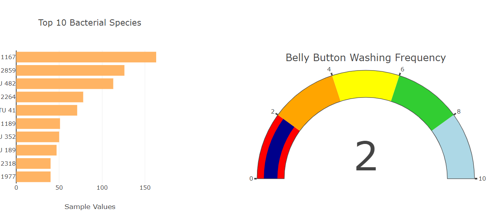
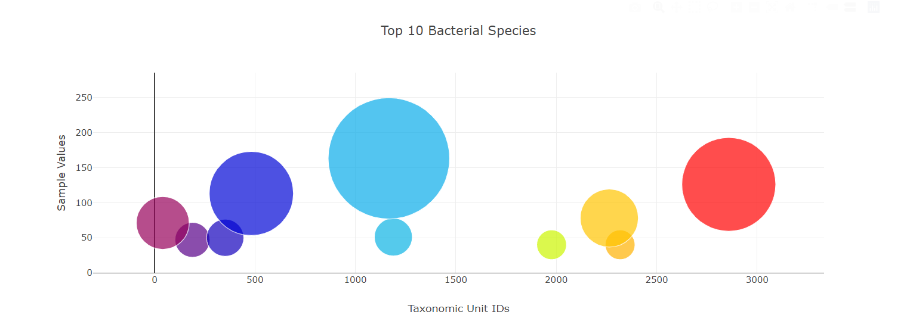

# Bacteria_to_Beef
In this module we are assisting Roza in completing a panel for demographic information to visualize the bacterial data. Specifically, her volunteers should be able to identify the top 10 bacterial species in their belly buttons. The project identifies whether the bacteria species is found in the navel.

National Geographic reported that 1,458 of the species "may be new to science," and some of the bacteria were entirely out of their known context. One person's belly button "harbored a bacterium that had previously been found only in soil from Japan," where he had never been. Another had two types of "extremophile bacteria that typically thrive in ice caps and thermal vents."
December 18, 2012 The Atlantic

https://pcurl1986.github.io/Bacteria_to_Beef/Challenge/

## plotly charts

The module taught us methods to create different charts from multiple datasets. The charts included line, pie, and vertical as well as horizontal bar. 
Within the challeng the charts are acompanied by an interactive scatterplot as well as agauge chart.These can be viewed through the attached link. https://pcurl1986.github.io/Bacteria_to_Beef/Challenge/

## Summary

This module was challenging in its use of the coding processes to pinpoint certain errors. One error noted was the creation of the array variable for the metadata. 

Learning about real studies that were conducted on bacterial species found in belly buttons was a bit shocking. Something to think about the next time I take a shower.

The personalization of the webpage was another highlight as it was personalizing the UFO webpage from Module 11. At first, I did not see the appeal of creating webpages. I am starting to appreciate the creation of these webpages especially learning the ins and outs of how they work.

